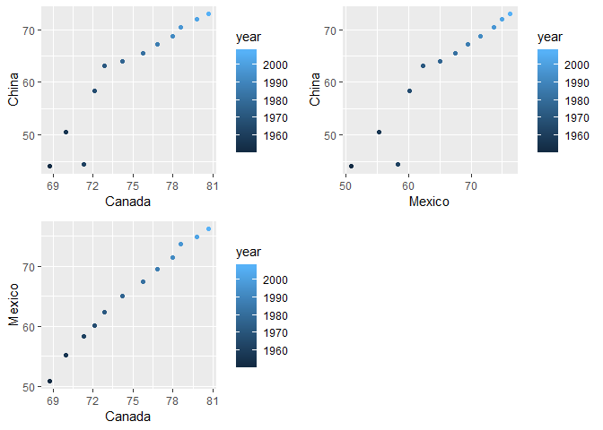
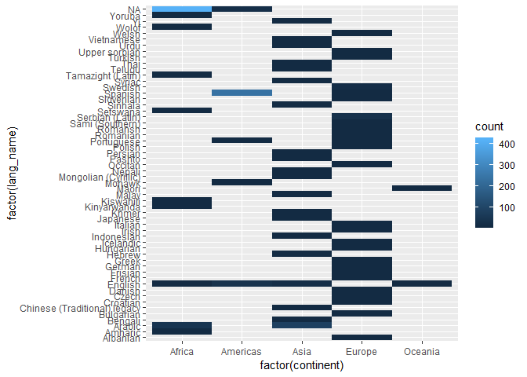

Assignment 4
================

``` r
suppressPackageStartupMessages(library(tidyverse))
suppressPackageStartupMessages(library(gapminder))
suppressPackageStartupMessages(library(gridExtra))
```

Exploring gather() and spread() for data reshaping
--------------------------------------------------

The prompt I have chosen to explore is **acivity 2**:

-   Make a tibble with one row per year and columns for life expectancy for two or more countries.
-   Use `knitr::kable()` to make this table look pretty in your rendered homework. Take advantage of this new data shape to scatterplot life expectancy for one country against that of another.

First, we explore the dataset `gapminder` and check the range of the year. Then we choose three country Canada ,Mexico and China and store their life-expectancy data in the new variable new\_exp.

``` r
head(gapminder)
```

    ## # A tibble: 6 x 6
    ##   country     continent  year lifeExp      pop gdpPercap
    ##   <fct>       <fct>     <int>   <dbl>    <int>     <dbl>
    ## 1 Afghanistan Asia       1952    28.8  8425333      779.
    ## 2 Afghanistan Asia       1957    30.3  9240934      821.
    ## 3 Afghanistan Asia       1962    32.0 10267083      853.
    ## 4 Afghanistan Asia       1967    34.0 11537966      836.
    ## 5 Afghanistan Asia       1972    36.1 13079460      740.
    ## 6 Afghanistan Asia       1977    38.4 14880372      786.

``` r
range(gapminder$year)
```

    ## [1] 1952 2007

``` r
## we first extract the life expectancy data for these three country from the gapminder dataset 
temp <- gapminder %>% 
  select(country,lifeExp,year) %>% 
  filter(country == "Canada" | country == "China" | country == "Mexico") 
 
# then a tibble is created with year, country and lifeExp
tidy_ver <- tibble(year=temp$year,country=temp$country,lifeExp=temp$lifeExp)
knitr::kable(tidy_ver)
```

|  year| country |   lifeExp|
|-----:|:--------|---------:|
|  1952| Canada  |  68.75000|
|  1957| Canada  |  69.96000|
|  1962| Canada  |  71.30000|
|  1967| Canada  |  72.13000|
|  1972| Canada  |  72.88000|
|  1977| Canada  |  74.21000|
|  1982| Canada  |  75.76000|
|  1987| Canada  |  76.86000|
|  1992| Canada  |  77.95000|
|  1997| Canada  |  78.61000|
|  2002| Canada  |  79.77000|
|  2007| Canada  |  80.65300|
|  1952| China   |  44.00000|
|  1957| China   |  50.54896|
|  1962| China   |  44.50136|
|  1967| China   |  58.38112|
|  1972| China   |  63.11888|
|  1977| China   |  63.96736|
|  1982| China   |  65.52500|
|  1987| China   |  67.27400|
|  1992| China   |  68.69000|
|  1997| China   |  70.42600|
|  2002| China   |  72.02800|
|  2007| China   |  72.96100|
|  1952| Mexico  |  50.78900|
|  1957| Mexico  |  55.19000|
|  1962| Mexico  |  58.29900|
|  1967| Mexico  |  60.11000|
|  1972| Mexico  |  62.36100|
|  1977| Mexico  |  65.03200|
|  1982| Mexico  |  67.40500|
|  1987| Mexico  |  69.49800|
|  1992| Mexico  |  71.45500|
|  1997| Mexico  |  73.67000|
|  2002| Mexico  |  74.90200|
|  2007| Mexico  |  76.19500|

``` r
# then we would like to form an untidy tibble by separating the data by country
 result <- spread(tidy_ver, key = "country", value = "lifeExp")
 knitr::kable(result)
```

|  year|  Canada|     China|  Mexico|
|-----:|-------:|---------:|-------:|
|  1952|  68.750|  44.00000|  50.789|
|  1957|  69.960|  50.54896|  55.190|
|  1962|  71.300|  44.50136|  58.299|
|  1967|  72.130|  58.38112|  60.110|
|  1972|  72.880|  63.11888|  62.361|
|  1977|  74.210|  63.96736|  65.032|
|  1982|  75.760|  65.52500|  67.405|
|  1987|  76.860|  67.27400|  69.498|
|  1992|  77.950|  68.69000|  71.455|
|  1997|  78.610|  70.42600|  73.670|
|  2002|  79.770|  72.02800|  74.902|
|  2007|  80.653|  72.96100|  76.195|

The data appeared under each country represented the life-expectancy of the corresponding country. To tidy up the above data, we could simply use the gather() function to reverse the process as shown below:

``` r
reverse <-  gather(result,key="country",value="life_Expectancy", China, Mexico,Canada)
head(reverse)
```

    ## # A tibble: 6 x 3
    ##    year country life_Expectancy
    ##   <int> <chr>             <dbl>
    ## 1  1952 China              44  
    ## 2  1957 China              50.5
    ## 3  1962 China              44.5
    ## 4  1967 China              58.4
    ## 5  1972 China              63.1
    ## 6  1977 China              64.0

The following step is to visualise the data with the scatterplot using these reshaped data. Here shows the pairwise comparison of life expectancy among these three country.Meanwhile, the different color stands for data from the different year.

``` r
p1 <- result %>% 
  ggplot(aes(Canada, China))+
  geom_point(aes(colour=year))

p2 <- result %>% 
  ggplot(aes(Mexico, China))+
  geom_point(aes(color=year))

p3 <- result %>% 
  ggplot(aes(Canada, Mexico))+
  geom_point(aes(color=year))
grid.arrange(p1,p2,p3,nrow=2,ncol=2)
```



Join Prompts (join, merge, look up)
-----------------------------------

The prompt I have chosen to explore is **acivity 1**:

First we create dataframe that complementary to Gapminder. we started with reading in a new dataset which contained the language spoken by the specific country.

``` r
temp <- read_csv("country_list.csv")
```

    ## Parsed with column specification:
    ## cols(
    ##   ID = col_integer(),
    ##   country_name = col_character(),
    ##   country_code_name = col_character(),
    ##   country_code = col_integer(),
    ##   lang_name = col_character(),
    ##   lang_code = col_character()
    ## )

``` r
head(temp)
```

    ## # A tibble: 6 x 6
    ##      ID country_name  country_code_name country_code lang_name   lang_code
    ##   <int> <chr>         <chr>                    <int> <chr>       <chr>    
    ## 1     1 Afghanistan   af                          93 Pashto      ps       
    ## 2     2 Albania       al                         355 Albanian    sq       
    ## 3     3 Algeria       dz                         213 Tamazight ~ tzm      
    ## 4     4 American Sam~ as                        1684 <NA>        <NA>     
    ## 5     5 Andorra       ad                         376 <NA>        <NA>     
    ## 6     6 Angola        ao                         244 <NA>        <NA>

``` r
## rename the country to match the gapminder dataset
t1 <- rename(temp,country=country_name)
## We keep only the lang_name and lang_code in the new table

new_data <- t1 %>% 
  select(country,lang_name,lang_code) 

head(new_data)
```

    ## # A tibble: 6 x 3
    ##   country        lang_name         lang_code
    ##   <chr>          <chr>             <chr>    
    ## 1 Afghanistan    Pashto            ps       
    ## 2 Albania        Albanian          sq       
    ## 3 Algeria        Tamazight (Latin) tzm      
    ## 4 American Samoa <NA>              <NA>     
    ## 5 Andorra        <NA>              <NA>     
    ## 6 Angola         <NA>              <NA>

Then we join the gapminder with the new\_data using different join function.

1. `left_join`
==============

in this case, the new\_data is matched to the gapminder dataset.

``` r
left_join(gapminder,new_data,by="country")
```

    ## Warning: Column `country` joining factor and character vector, coercing
    ## into character vector

    ## # A tibble: 1,728 x 8
    ##    country   continent  year lifeExp     pop gdpPercap lang_name lang_code
    ##    <chr>     <fct>     <int>   <dbl>   <int>     <dbl> <chr>     <chr>    
    ##  1 Afghanis~ Asia       1952    28.8  8.43e6      779. Pashto    ps       
    ##  2 Afghanis~ Asia       1957    30.3  9.24e6      821. Pashto    ps       
    ##  3 Afghanis~ Asia       1962    32.0  1.03e7      853. Pashto    ps       
    ##  4 Afghanis~ Asia       1967    34.0  1.15e7      836. Pashto    ps       
    ##  5 Afghanis~ Asia       1972    36.1  1.31e7      740. Pashto    ps       
    ##  6 Afghanis~ Asia       1977    38.4  1.49e7      786. Pashto    ps       
    ##  7 Afghanis~ Asia       1982    39.9  1.29e7      978. Pashto    ps       
    ##  8 Afghanis~ Asia       1987    40.8  1.39e7      852. Pashto    ps       
    ##  9 Afghanis~ Asia       1992    41.7  1.63e7      649. Pashto    ps       
    ## 10 Afghanis~ Asia       1997    41.8  2.22e7      635. Pashto    ps       
    ## # ... with 1,718 more rows

2. `right_join`
===============

in this case, the gapminder is matched to the new\_data.

``` r
right_join(gapminder,new_data,by="country")
```

    ## Warning: Column `country` joining factor and character vector, coercing
    ## into character vector

    ## # A tibble: 1,685 x 8
    ##    country   continent  year lifeExp     pop gdpPercap lang_name lang_code
    ##    <chr>     <fct>     <int>   <dbl>   <int>     <dbl> <chr>     <chr>    
    ##  1 Afghanis~ Asia       1952    28.8  8.43e6      779. Pashto    ps       
    ##  2 Afghanis~ Asia       1957    30.3  9.24e6      821. Pashto    ps       
    ##  3 Afghanis~ Asia       1962    32.0  1.03e7      853. Pashto    ps       
    ##  4 Afghanis~ Asia       1967    34.0  1.15e7      836. Pashto    ps       
    ##  5 Afghanis~ Asia       1972    36.1  1.31e7      740. Pashto    ps       
    ##  6 Afghanis~ Asia       1977    38.4  1.49e7      786. Pashto    ps       
    ##  7 Afghanis~ Asia       1982    39.9  1.29e7      978. Pashto    ps       
    ##  8 Afghanis~ Asia       1987    40.8  1.39e7      852. Pashto    ps       
    ##  9 Afghanis~ Asia       1992    41.7  1.63e7      649. Pashto    ps       
    ## 10 Afghanis~ Asia       1997    41.8  2.22e7      635. Pashto    ps       
    ## # ... with 1,675 more rows

These two methods results in different row numbers since they are joined with different reference.

3. `semi_join`
==============

``` r
## This only return return all rows from new_data where there are matching values in gapminder, keeping just columns from new_data.
semi_join(new_data,gapminder,by="country")
```

    ## Warning: Column `country` joining character vector and factor, coercing
    ## into character vector

    ## # A tibble: 132 x 3
    ##    country     lang_name         lang_code
    ##    <chr>       <chr>             <chr>    
    ##  1 Afghanistan Pashto            ps       
    ##  2 Albania     Albanian          sq       
    ##  3 Algeria     Tamazight (Latin) tzm      
    ##  4 Angola      <NA>              <NA>     
    ##  5 Argentina   Spanish           es       
    ##  6 Australia   English           en       
    ##  7 Austria     German            de       
    ##  8 Bahrain     Arabic            ar       
    ##  9 Bangladesh  Bengali           bn       
    ## 10 Belgium     French            fr       
    ## # ... with 122 more rows

``` r
##  This only return return all rows from gapminder where there are matching values in new_data, keeping just columns from gapminder.
semi_join(gapminder,new_data,by="country")
```

    ## Warning: Column `country` joining factor and character vector, coercing
    ## into character vector

    ## # A tibble: 1,560 x 6
    ##    country     continent  year lifeExp      pop gdpPercap
    ##    <fct>       <fct>     <int>   <dbl>    <int>     <dbl>
    ##  1 Afghanistan Asia       1952    28.8  8425333      779.
    ##  2 Afghanistan Asia       1957    30.3  9240934      821.
    ##  3 Afghanistan Asia       1962    32.0 10267083      853.
    ##  4 Afghanistan Asia       1967    34.0 11537966      836.
    ##  5 Afghanistan Asia       1972    36.1 13079460      740.
    ##  6 Afghanistan Asia       1977    38.4 14880372      786.
    ##  7 Afghanistan Asia       1982    39.9 12881816      978.
    ##  8 Afghanistan Asia       1987    40.8 13867957      852.
    ##  9 Afghanistan Asia       1992    41.7 16317921      649.
    ## 10 Afghanistan Asia       1997    41.8 22227415      635.
    ## # ... with 1,550 more rows

4. `anti_join`
==============

With the anti\_join, it returns all rows from new\_data where there are not matching values in gapminder, keeping just columns from new\_data. So the following table shows the country with no information in gapminder.

``` r
anti_join(new_data, gapminder)
```

    ## Joining, by = "country"

    ## Warning: Column `country` joining character vector and factor, coercing
    ## into character vector

    ## # A tibble: 101 x 3
    ##    country             lang_name     lang_code
    ##    <chr>               <chr>         <chr>    
    ##  1 American Samoa      <NA>          <NA>     
    ##  2 Andorra             <NA>          <NA>     
    ##  3 Anguilla            <NA>          <NA>     
    ##  4 Antigua and Barbuda <NA>          <NA>     
    ##  5 Armenia             Armenian      hy       
    ##  6 Aruba               <NA>          <NA>     
    ##  7 Azerbaijan          Azeri (Latin) az       
    ##  8 Bahamas             <NA>          <NA>     
    ##  9 Barbados            <NA>          <NA>     
    ## 10 Belarus             Belarusian    be       
    ## # ... with 91 more rows

5. `inner_join()`
=================

This return all rows from gapminder where there are matching values in new\_data, and all columns from gapminder and new\_data. If there are multiple matches between gapminder and new\_data, all combination of the matches are returned.

``` r
inner_join(gapminder,new_data)
```

    ## Joining, by = "country"

    ## Warning: Column `country` joining factor and character vector, coercing
    ## into character vector

    ## # A tibble: 1,584 x 8
    ##    country   continent  year lifeExp     pop gdpPercap lang_name lang_code
    ##    <chr>     <fct>     <int>   <dbl>   <int>     <dbl> <chr>     <chr>    
    ##  1 Afghanis~ Asia       1952    28.8  8.43e6      779. Pashto    ps       
    ##  2 Afghanis~ Asia       1957    30.3  9.24e6      821. Pashto    ps       
    ##  3 Afghanis~ Asia       1962    32.0  1.03e7      853. Pashto    ps       
    ##  4 Afghanis~ Asia       1967    34.0  1.15e7      836. Pashto    ps       
    ##  5 Afghanis~ Asia       1972    36.1  1.31e7      740. Pashto    ps       
    ##  6 Afghanis~ Asia       1977    38.4  1.49e7      786. Pashto    ps       
    ##  7 Afghanis~ Asia       1982    39.9  1.29e7      978. Pashto    ps       
    ##  8 Afghanis~ Asia       1987    40.8  1.39e7      852. Pashto    ps       
    ##  9 Afghanis~ Asia       1992    41.7  1.63e7      649. Pashto    ps       
    ## 10 Afghanis~ Asia       1997    41.8  2.22e7      635. Pashto    ps       
    ## # ... with 1,574 more rows

6. `full_join()`
================

This is the optimal method to retain all the useful information among the dataset new\_data and gapminder. `full_join` return all rows and all columns from both new\_data and gapminder. Where there are not matching values, returns NA for the one missing.

``` r
full_join(new_data, gapminder)
```

    ## Joining, by = "country"

    ## Warning: Column `country` joining character vector and factor, coercing
    ## into character vector

    ## # A tibble: 1,829 x 8
    ##    country   lang_name lang_code continent  year lifeExp     pop gdpPercap
    ##    <chr>     <chr>     <chr>     <fct>     <int>   <dbl>   <int>     <dbl>
    ##  1 Afghanis~ Pashto    ps        Asia       1952    28.8  8.43e6      779.
    ##  2 Afghanis~ Pashto    ps        Asia       1957    30.3  9.24e6      821.
    ##  3 Afghanis~ Pashto    ps        Asia       1962    32.0  1.03e7      853.
    ##  4 Afghanis~ Pashto    ps        Asia       1967    34.0  1.15e7      836.
    ##  5 Afghanis~ Pashto    ps        Asia       1972    36.1  1.31e7      740.
    ##  6 Afghanis~ Pashto    ps        Asia       1977    38.4  1.49e7      786.
    ##  7 Afghanis~ Pashto    ps        Asia       1982    39.9  1.29e7      978.
    ##  8 Afghanis~ Pashto    ps        Asia       1987    40.8  1.39e7      852.
    ##  9 Afghanis~ Pashto    ps        Asia       1992    41.7  1.63e7      649.
    ## 10 Afghanis~ Pashto    ps        Asia       1997    41.8  2.22e7      635.
    ## # ... with 1,819 more rows

7. `bind_rows()`
================

With function `bind_rows()`, it simply append the gapminder to new\_data as the new row and the missing information in each entry will be shown as "NA". The problem with this join method is it won't match the row withe the same country name, therefore, it is not useful for analysis. In addition, another similar function \`bin\_cols' will not work in this case since these datasets have different row number.

``` r
bind_rows(new_data,gapminder)
```

    ## Warning in bind_rows_(x, .id): binding character and factor vector,
    ## coercing into character vector

    ## # A tibble: 1,937 x 8
    ##    country    lang_name  lang_code continent  year lifeExp   pop gdpPercap
    ##    <chr>      <chr>      <chr>     <fct>     <int>   <dbl> <int>     <dbl>
    ##  1 Afghanist~ Pashto     ps        <NA>         NA      NA    NA        NA
    ##  2 Albania    Albanian   sq        <NA>         NA      NA    NA        NA
    ##  3 Algeria    Tamazight~ tzm       <NA>         NA      NA    NA        NA
    ##  4 American ~ <NA>       <NA>      <NA>         NA      NA    NA        NA
    ##  5 Andorra    <NA>       <NA>      <NA>         NA      NA    NA        NA
    ##  6 Angola     <NA>       <NA>      <NA>         NA      NA    NA        NA
    ##  7 Anguilla   <NA>       <NA>      <NA>         NA      NA    NA        NA
    ##  8 Antigua a~ <NA>       <NA>      <NA>         NA      NA    NA        NA
    ##  9 Argentina  Spanish    es        <NA>         NA      NA    NA        NA
    ## 10 Armenia    Armenian   hy        <NA>         NA      NA    NA        NA
    ## # ... with 1,927 more rows

Finally, we can have plottings to better visualise the spread of different languages:

``` r
temp <- inner_join(gapminder, new_data, by = "country") %>% 
  select(continent,country,lang_name)
```

    ## Warning: Column `country` joining factor and character vector, coercing
    ## into character vector

``` r
## spread the language by language name

lang_count <- temp %>% 
  group_by(lang_name) %>% 
  tally()
knitr::kable(lang_count)
```

| lang\_name                   |    n|
|:-----------------------------|----:|
| Albanian                     |   12|
| Amharic                      |   12|
| Arabic                       |  132|
| Bengali                      |   12|
| Bulgarian                    |   12|
| Chinese (Traditional) legacy |   12|
| Croatian                     |   12|
| Czech                        |   12|
| Danish                       |   12|
| English                      |   84|
| French                       |   12|
| Frisian                      |   12|
| German                       |   12|
| Greek                        |   12|
| Hebrew                       |   12|
| Hungarian                    |   12|
| Icelandic                    |   12|
| Indonesian                   |   12|
| Irish                        |   12|
| Italian                      |   12|
| Japanese                     |   12|
| Khmer                        |   12|
| Kinyarwanda                  |   12|
| Kiswahili                    |   12|
| Malay                        |   12|
| Maori                        |   12|
| Mohawk                       |   12|
| Mongolian (Cyrillic)         |   12|
| Nepali                       |   12|
| Occitan                      |   12|
| Pashto                       |   12|
| Persian                      |   12|
| Polish                       |   12|
| Portuguese                   |   24|
| Romanian                     |   12|
| Romansh                      |   12|
| Sami (Southern)              |   12|
| Serbian (Latin)              |   36|
| Setswana                     |   12|
| Sinhala                      |   12|
| Slovenian                    |   12|
| Spanish                      |  252|
| Swedish                      |   24|
| Syriac                       |   12|
| Tamazight (Latin)            |   12|
| Telugu                       |   12|
| Thai                         |   12|
| Turkish                      |   12|
| Upper sorbian                |   12|
| Urdu                         |   12|
| Vietnamese                   |   12|
| Welsh                        |   12|
| Wolof                        |   12|
| Yi                           |   12|
| Yoruba                       |   12|
| NA                           |  444|

``` r
## we are going to plot the languages used by more than 15 countries

ggplot(temp,aes(factor(continent),factor(lang_name)))+
  geom_bin2d()
```



Although there are a lot of different languages all over the world, from the above graph, we can conclude that Asia and Europe have more diverse language while countries in Americas and Oceania speaks common languages.
